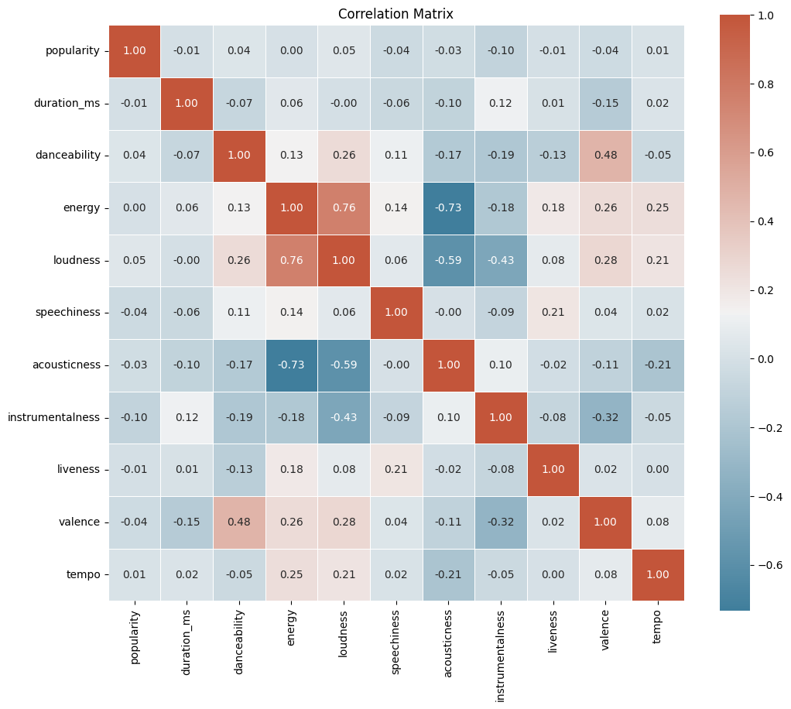
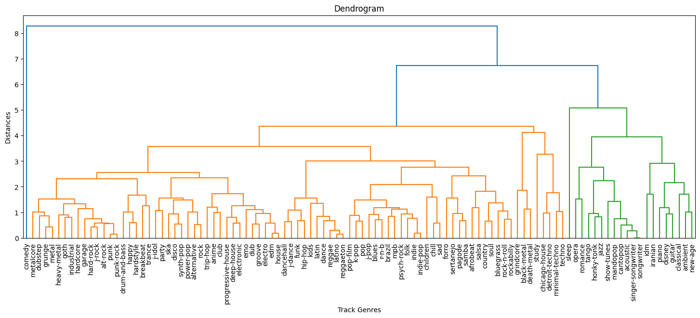

# AmalgaMix  
**AI-Powered Music Recommendation Web App**

AmalgaMix is a **full-stack application** that connects to Spotify, analyzes playlists, and generates personalized recommendations. It combines **React, Node.js, FastAPI, and Keras** to serve an end-to-end machine learning pipeline!

---

## Features
- Extracts **Spotify audio features** (danceability, energy, loudness, tempo, etc.)  
- Identifies playlist similarities across different users  
- Predicts **playlist genres** with a custom neural network  
- Generates personalized recommendations based on **top-3 predicted genres**  

---

## System Architecture
**Frontend (React.js)**  
- Spotify OAuth login & playlist selection  
- Displays recommended tracks  

**Backend (Node.js + Express)**  
- Handles Spotify API requests  
- Sends playlist features to ML service  
- Returns recommendations  

**ML API (FastAPI + TensorFlow/Keras)**  
- Hosts trained model  
- Predicts genres & retrieves recommendations  

---

## Dataset & Preprocessing
- **Source**: Kaggle Spotify Dataset (~166K tracks after augmentation)  
- **Features**: 20 per track (numeric + categorical)  
- **Target**: Genre classification (114 → 57 consolidated via clustering)  
- **Balance**: Most genres ≥500 samples  

### Preprocessing Pipeline
- One-hot encoding for `key` and `time_signature`  
- Standard scaling for numerical features  
- Noise augmentation (duration/popularity shifting + Gaussian noise)  
- Genre clustering with **hierarchical dendrogram**  

<p align="center"></p>  
<p align="center"><em>Fig 1: Feature Correlation Matrix</em></p>  

<p align="center"></p>  
<p align="center"><em>Fig 2: Genre Clustering via Dendrogram</em></p>  


---

## Model Training
Two architectures were explored:  

**1. Fully Connected Neural Net**  
- 6 dense layers (1028 → 64 units)  
- ReLU + Swish activations  
- Dropout & L2 regularization  
- Softmax output  

**2. Convolutional + Dense Hybrid**  
- 3 × Conv1D layers + MaxPooling  
- GlobalAveragePooling → Dense layers  
- Softmax output  

**Training Details**  
- Optimizer: Adam (lr=0.0001)  
- Loss: Sparse categorical crossentropy  
- Early stopping (patience=30)  
- Augmented dataset (166K samples)  
- 400 epochs (avg. convergence ~200)  

**Results**  
- Logistic regression baseline: **30% accuracy** 
- **Dense model**: 76% top-1 accuracy, 81% top-3  
- **Conv1D model**: 42.5% top-1, 66.8% top-3

---

## Recommendation Engine
- Aggregates playlist features (mean for numeric, mode for categorical)  
- Predicts top-3 genres  
- Retrieves recommendations from within those genres  

---

## Getting Started
### Prerequisites
- Node.js 18+  
- Python 3.10+  
- Spotify Developer Account  
- Kaggle dataset  

### Installation
```bash
# Clone repository
git clone https://github.com/yourusername/amalgamix.git
cd amalgamix

# Frontend
cd frontend && npm install

# Backend
cd ../backend && npm install

# ML Model API
cd ../ml_model && pip install -r requirements.txt


